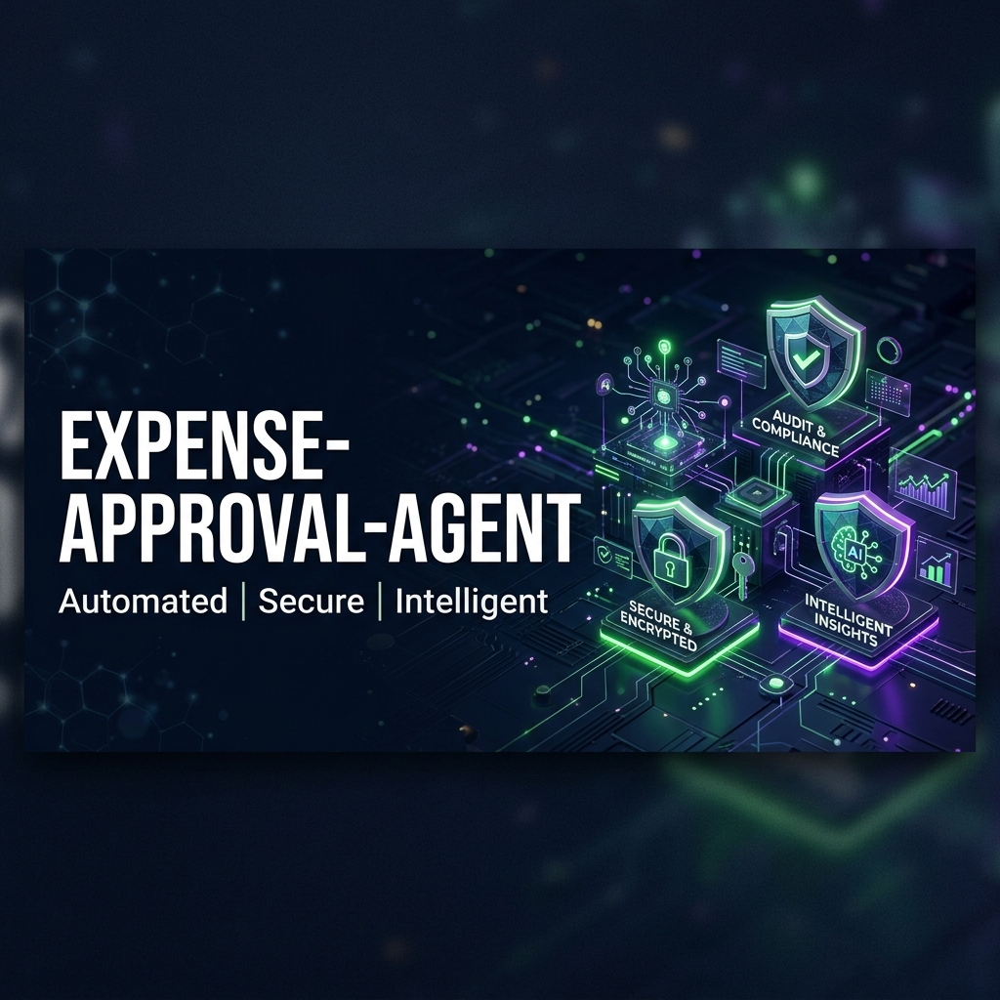
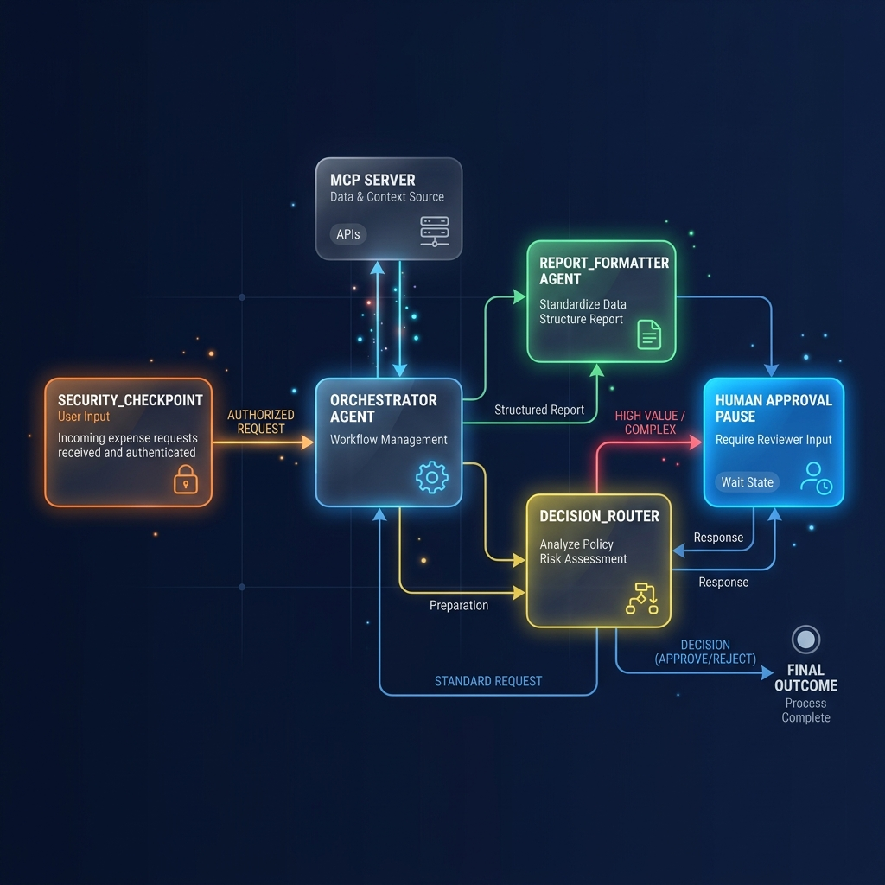
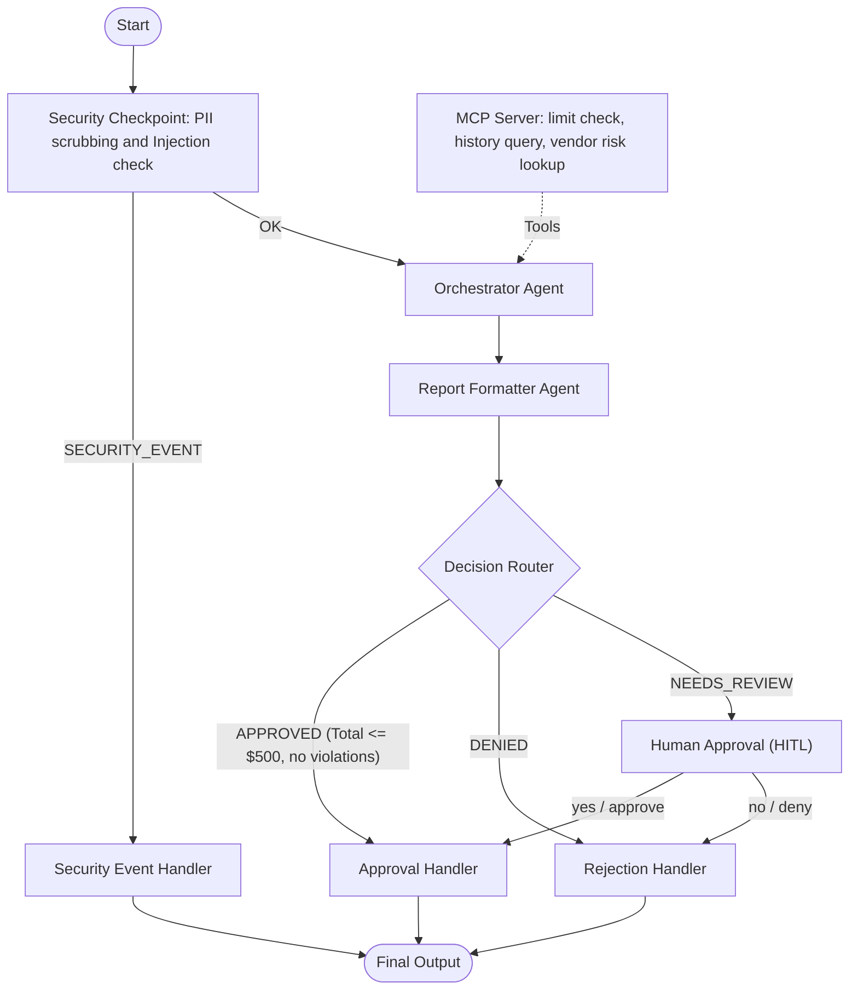

# expense-approval-agent
Automated and secure multi-agent expense auditing and approval assistant built with ADK and FastMCP.



## Prerequisites
- **Python 3.11+**
- **uv**: Python package manager - [Install](https://docs.astral.sh/uv/getting-started/installation/)
- **Gemini API key**: Create a key in [Google AI Studio](https://aistudio.google.com/apikey)

## Quick Start
```bash
git clone <repo-url>
cd expense-approval-agent
cp .env.example .env   # Add your GOOGLE_API_KEY inside the file
make install           # Syncs environment dependencies via uv
make playground        # Launches interactive UI at http://localhost:18081
```

## Architecture
The agent uses a multi-agent workflow coordinated by an ADK 2.0 graph. The flow diagram below illustrates the routing paths, security checkpoint, sub-agents, and tools:





## How to Run

### Interactive UI Mode (Playground)
Runs the ADK Web Playground on port 18081 where you can converse with and test the agent workflow:
* **Windows**:
  ```powershell
  uv run adk web app --host 127.0.0.1 --port 18081 --reload_agents
  ```
* **macOS / Linux**:
  ```bash
  make playground
  ```

### FastAPI Local Web Server Mode
Launches the FastAPI server to expose endpoints for production and API usage:
```bash
make run
```

### Run Tests
```bash
make test
```

## Sample Test Cases

### Case 1: Auto-Approved Claim (Clean & <= $500)
* **Input (JSON)**:
  ```json
  {
    "employee_name": "Alice Smith",
    "employee_role": "Engineer",
    "items": [
      {
        "category": "Meals",
        "amount": 75.50,
        "description": "Lunch with prospective candidate"
      },
      {
        "category": "Subscriptions",
        "amount": 25.00,
        "description": "Copilot subscription"
      }
    ]
  }
  ```
* **Expected Flow**:
  1. `security_checkpoint` parses input and routes `OK`.
  2. `orchestrator` uses `get_employee_policy_limit` to check Engineer limit ($500) and `query_previous_expenses` to fetch history.
  3. `report_formatter` formats the notes into an `ExpenseAuditReport` structure.
  4. `decision_router` sees no violations and total <= $500, routing to `APPROVED`.
  5. `approval_handler` outputs: `✅ Expense Claim APPROVED`
* **Check**: Under the playground conversation tab, the final agent card should display the approved status and explanation directly.

### Case 2: Policy Violation & Manager HITL Review (Meals Limit Exceeded)
* **Input (JSON)**:
  ```json
  {
    "employee_name": "Bob Jones",
    "employee_role": "Engineer",
    "items": [
      {
        "category": "Meals",
        "amount": 145.00,
        "description": "Team lunch celebration"
      }
    ]
  }
  ```
* **Expected Flow**:
  1. `security_checkpoint` passes `OK` routing.
  2. `orchestrator` notes a meals limit policy violation (meals max is $100).
  3. `decision_router` flags a policy violation and routes to `NEEDS_REVIEW`.
  4. `human_approval` triggers an interrupt and prompts: `Approve? (reply 'yes' or 'no')`.
  5. Replying `yes` routes to `approval_handler` resulting in: `✅ Expense Claim APPROVED (Approved by manager)`
* **Check**: The playground UI will pause and display an input box asking for manager authorization.

### Case 3: PII Security Block (SSN Leak)
* **Input (JSON)**:
  ```json
  {
    "employee_name": "David Miller",
    "employee_role": "Developer",
    "items": [
      {
        "category": "Meals",
        "amount": 45.00,
        "description": "Receipt reference SSN 000-12-3456"
      }
    ]
  }
  ```
* **Expected Flow**:
  1. `security_checkpoint` catches the SSN format and routes `SECURITY_EVENT`.
  2. `security_event_handler` logs a security alert.
  3. Final output displays: `⚠️ SECURITY BLOCK`
* **Check**: The playground immediately exits without calling the main LLM agents, displaying a security block warning.

## Troubleshooting

1. **"no agents found" or "Got unexpected extra arguments"**:
   Make sure you are running the `uv run adk web app` command from inside the `expense-approval-agent` subfolder, and using `app` as the agent directory.
2. **`429 RESOURCE_EXHAUSTED`**:
   You have exceeded your Gemini free-tier quota (RPM/TPM). Wait one minute for your per-minute limits to clear, or configure `GEMINI_MODEL=gemini-2.5-flash-lite` in `.env` to lower token consumption.
3. **Changes to agent.py not updating**:
   On Windows, hot-reload is disabled because of Watchdog conflicts with process spawning. Run the PowerShell process killer and relaunch:
   ```powershell
   Get-Process -Id (Get-NetTCPConnection -LocalPort 18081, 8090 -ErrorAction SilentlyContinue).OwningProcess | Stop-Process -Force
   ```

## Push to GitHub

1. Create a new repo at https://github.com/new
   - Name: expense-approval-agent
   - Visibility: Public or Private
   - Do NOT initialize with README (you already have one)

2. In your terminal, navigate into your project folder:
   ```bash
   cd expense-approval-agent
   git init
   git add .
   git commit -m "Initial commit: expense-approval-agent ADK agent"
   git branch -M main
   git remote add origin https://github.com/<your-username>/expense-approval-agent.git
   git push -u origin main
   ```

3. Verify `.gitignore` includes:
   ```
   .env          ← your API key — must NEVER be pushed
   .venv/
   __pycache__/
   *.pyc
   .adk/
   ```

⚠️ NEVER push `.env` to GitHub. Your API key will be exposed publicly.